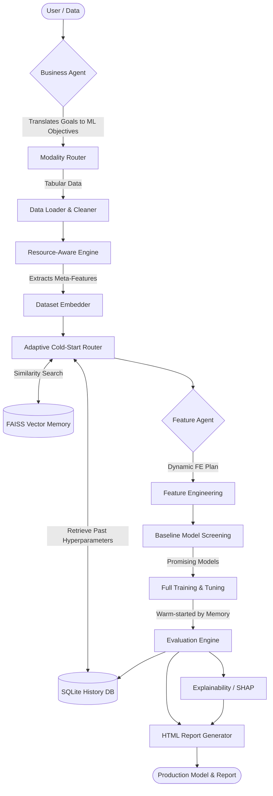

# ML-Builder: A META-LEARNING DRIVEN AUTOML AND AUTODL SYSTEM WITH LLM-ASSISTED PIPELINE OPTIMIZATION

---

## 2. Project Overview

**What problem this project solves:**
Building machine learning models traditionally involves a slow, manual process of data cleaning, feature engineering, model selection, and hyperparameter tuning. Data scientists spend weeks iterating to find the right configuration. **ML-Builder** automates this entire lifecycle, turning raw data into an optimized, explainable model in minutes, while automatically preventing out-of-memory errors on large datasets.

**Why traditional ML workflows are slow:**
Humans must manually inspect data, guess which transformations might work, write boilerplate code for dozens of models, and patiently wait for grid searches to finish, often repeating the exact same trial-and-error process for similar datasets.

**Why AutoML exists:**
Automated Machine Learning (AutoML) solves this by programmatically running through data cleaning, feature selection, and algorithm testing. However, most AutoML systems start "blind" every time—they don't remember what worked yesterday.

**Why Meta-Learning is useful:**
Meta-learning is "learning to learn." ML-Builder computes a mathematical "fingerprint" (embedding) of every dataset it sees. It remembers which models and hyperparameters succeeded on previous, similar datasets. By recalling these past successes (warm-starting), it skips the blind trial-and-error phase, drastically accelerating the search for the best model.

**Why Agentic AI is integrated:**
Standard AutoML requires users to know technical details like "F1-Score" or "Log-Transformations." ML-Builder uses Large Language Models (LLMs) as interactive agents. A Business Agent talks to the user to understand their high-level goals (e.g., "predict customer churn"), and translates that into strict machine learning objectives. A Feature Agent acts as a senior data scientist, dynamically writing a bespoke feature engineering strategy based on the data's profile.

---

## 3. Key Features

| Feature | Description |
|---|---|
| **Adaptive AutoML** | Automatically screens, trains, and tunes multiple baseline models, dynamically scaling cross-validation based on available RAM. |
| **Meta Learning Memory** | "Learns" from previous experiments to warm-start Neural Architecture Search (NAS) and model training. |
| **FAISS Vector Search** | Extracts dataset meta-features and uses vector search to instantly find historically similar datasets. |
| **Agentic AI Workflow** | Uses LLM agents (Business Agent & Feature Agent) to map human objectives to ML pipelines. |
| **Resource-Aware Engine** | Proactively prevents out-of-memory (OOM) errors by capping One-Hot encoding and scaling down feature interactions on massive datasets. |
| **SHAP Explainability** | Automatically generates global and local feature importance plots to explain model decisions. |
| **Automated HTML Reporting** | Produces a comprehensive, self-contained HTML report with EDA charts, metrics, and explanations. |

---

## 4. High-Level System Architecture



---

## 5. Layer-by-Layer Architecture

### Layer 1 — User Interaction & Agent Layer
**Purpose:** Bridge the gap between human business needs and technical ML execution.
**Mechanism:** The `BusinessContextAgent` gathers constraints and objectives (e.g., "Must be highly interpretable") and translates them into pipeline rules (e.g., `model_constraints: ["tree_based"]`).

### Layer 2 — Data Understanding & Resource Management Layer
**Purpose:** Safely ingest data without crashing the system.
**Mechanism:** The `DataLoader` structures the data, while the `ResourceManager` analyzes the row/column count to set hard memory caps, capping feature interactions or downgrading high-cardinality columns to frequency encoding instead of one-hot encoding.

### Layer 3 — Meta-Learning & Memory Layer
**Purpose:** Exploit historical knowledge to accelerate the current run.
**Mechanism:** `dataset_embedding.py` calculates a 10D vector of dataset statistics. `cold_start.py` uses FAISS to find the closest historical matches. If a match is found, the system retrieves the winning hyperparameters to skip baseline screening.

### Layer 4 — Feature Engineering Layer
**Purpose:** Transform raw data into highly predictive signals.
**Mechanism:** The `FeatureEngineeringAgent` reviews the data profile and suggests an optimal strategy. The pipeline then executes outlier capping, log-transforms for skewed data, and builds interaction features.

### Layer 5 — Training & Optimization Layer
**Purpose:** Find the mathematical model that best fits the data.
**Mechanism:** A fast baseline screen drops underperforming algorithms. The top candidates undergo full Cross-Validation and Hyperparameter Tuning.

### Layer 6 — Explainability & Reporting Layer
**Purpose:** Build trust in the model.
**Mechanism:** SHAP (SHapley Additive exPlanations) calculates exactly how much each feature contributed to predictions. An HTML report packages all EDA, metrics, and plots for stakeholders.

---

## 6. Complete Data Flow

1. **Step 1:** User uploads dataset and interacts with the **Business Agent**.
2. **Step 2:** The dataset is loaded, automatically classified as Classification or Regression, and cleaned (missing values imputed).
3. **Step 3:** The **Resource Manager** evaluates dataset size to assign a safety tier (Small, Medium, Large) to restrict memory usage.
4. **Step 4:** **Meta-features** (skewness, entropy, missing ratios) are extracted into a 10D embedding vector.
5. **Step 5:** **Memory Retrieval**: FAISS searches for similar datasets. The Cold-Start logic decides whether to rely on past memory or run a broad AutoML search.
6. **Step 6:** The **Feature Agent** creates an intelligent preprocessing plan (e.g., log-transforming income, targeting encoding high-cardinality IDs).
7. **Step 7:** **Baseline Screening** tests multiple algorithms (Random Forest, XGBoost, etc.) on a subsample.
8. **Step 8:** **Full Training** scales up the best models to the full dataset, optionally tuning them.
9. **Step 9:** **Evaluation** selects the global best model based on F1-Score (Classification) or RMSE (Regression).
10. **Step 10:** The model's logic is demystified via **SHAP Explainability**.
11. **Step 11:** The final configuration is saved back to the **Memory System** for future runs, and an HTML report is generated.

---

## 7. Core Components Deep Dive

### `main.py`
**Purpose:** The central orchestrator.
**Responsibilities:** Parses command-line arguments, triggers each pipeline step sequentially, and manages the state between modules.
**Inputs:** Dataset path, target column, configuration flags.
**Outputs:** Serialized model (`.pkl`), metrics CSV, HTML Report.
**How it interacts:** It calls every other module in the system, acting as the nervous system.

### `resource_manager.py`
**Purpose:** Prevents Out-Of-Memory (OOM) crashes and feature explosions.
**Responsibilities:** Analyzes dataset size and cardinality. It dynamically downgrades one-hot encoding to frequency encoding if the dataset has too many unique categorical values.
**Inputs:** Cleaned Dataframe.
**Outputs:** Dictionary of safe constraints (e.g., max interaction features, allowed models).

### `dataset_embedding.py`
**Purpose:** Creates a mathematical fingerprint of a dataset.
**Responsibilities:** Calculates a 10-dimensional vector containing metrics like log-scaled sample count, missing ratio, mean skewness, and target entropy.
**Inputs:** Pandas DataFrame and Target Series.
**Outputs:** `float32` numpy array of size 10.
**How it interacts:** Provides the coordinate vector used by the FAISS index to map datasets in a high-dimensional space.

### `cold_start.py`
**Purpose:** Decides whether to use memory or start from scratch.
**Responsibilities:** Compares the new dataset's embedding against the FAISS index. Computes an adaptive threshold ($\epsilon$). If similarity > $\epsilon$, it warm-starts using the historical best model; otherwise, it triggers a broad baseline search.
**Inputs:** Query embedding, FAISS index.
**Outputs:** Decision routing string (`memory` vs `cold_start`) and shortlisted models.

### `agents/business_agent.py` & `agents/feature_agent.py`
**Purpose:** Injects LLM reasoning into standard AutoML.
**Responsibilities:** Uses `litellm` (GPT-4o-mini) to translate human constraints into JSON-formatted technical rules (e.g., prioritizing precision over recall) and recommends bespoke data transformations.
**Inputs:** User text input / Statistical data profiles.
**Outputs:** Structured JSON dictionaries governing pipeline behavior.

---

## 8. Meta-Learning Memory System

**What is Meta-Learning?**
Machine Learning is algorithms learning from *data*. Meta-Learning is algorithms learning from *experiments*. Over time, the system learns that datasets with high skewness and categorical features usually respond best to XGBoost with specific depth constraints. 

**Database Memory vs Vector Memory**
A standard database (SQLite) stores exact matches (e.g., "What was the best model for 'housing.csv'?"). 
A vector memory (FAISS) stores *concepts* (e.g., "Find me models that succeeded on datasets that mathematically *look like* this new one").

**The Architecture:**
1. **Extraction:** A dataset is reduced to 10 meta-features.
2. **Indexing:** This vector is stored in FAISS, linked to a SQLite ID.
3. **Retrieval:** A new dataset is converted to a vector. We calculate the Euclidean distance to all stored vectors to find the "Nearest Neighbors".
4. **Warm-Starting:** We extract the hyperparameter JSON of the nearest neighbor and feed it directly into the current training loop.

---

## 9. FAISS Vector Search Explanation

**Embeddings and Meta-features:**
An embedding is simply an array of numbers representing characteristics.
Imagine a 3D embedding: `[Numeric_Percentage, Missing_Data_Percentage, Rows]`.
Dataset A (Banking): `[0.95, 0.01, 10000]`
Dataset B (Finance): `[0.90, 0.02, 12000]`
Dataset C (Images): `[0.00, 0.00, 500]`

**Similarity Search:**
If we plot these arrays as coordinates in a 3D graph, Dataset A and B will be clustered very close together, while Dataset C will be far away. 
FAISS (Facebook AI Similarity Search) calculates the spatial distance (Euclidean Distance or Cosine Similarity) between these points at lightning speed. Because A and B are close, ML-Builder assumes that whatever model worked for A will likely work for B.

---

## 10. Agentic AI Architecture

The system uses specialized LLM prompts to act as autonomous agents in the pipeline.

### Business Agent
**Purpose:** Acts as a Product Manager.
**Prompt Flow:** Asks the user for their primary goal and constraints. 
**Decision Process:** The LLM receives "We need to catch fraudulent transactions, but we can't afford false alarms." It outputs JSON: `{"optimization_priority": "precision", "model_constraints": ["highly_interpretable"]}`.

### Feature Agent
**Purpose:** Acts as a Senior Data Scientist.
**Prompt Flow:** Receives a JSON profile of the data (e.g., `{"column": "income", "skewness": 3.4}`). 
**Decision Process:** The LLM reasons that high skewness requires normalization and outputs a strategy: `{"suggested_transformations": ["log_transform_income"]}`.

---

## 11. Machine Learning Pipeline


1. **Baseline Screening:** Trains 5-8 fast algorithms (Random Forest, Logistic Regression) on 30% of the data. Drops the worst performers.
2. **Full Training:** Takes the survivors and trains them on 100% of the data.
3. **Hyperparameter Tuning:** Uses RandomizedSearchCV to tweak the internal settings of the winning models to squeeze out extra performance.

---

## 12. Explainability Layer

Businesses cannot trust "black box" models. They need to know *why* an AI made a decision.

**SHAP (SHapley Additive exPlanations):**
Rooted in game theory, SHAP calculates the exact marginal contribution of every single feature to the final prediction.
- **Global Explanations:** "Across all customers, 'Account Age' is the most important factor in preventing churn."
- **Local Explanations:** "For Customer John Doe specifically, his high 'Monthly Charges' increased his churn probability by 22%."

---

## 13. Database Architecture

The system uses a hybrid approach:
1. **FAISS Index (`dl_memory_*.faiss`):** Stores raw float arrays for high-speed mathematical nearest-neighbor search.
2. **SQLite Database (`dl_memory.db`):**

**`dl_history` Table:**
| Column | Type | Description |
|---|---|---|
| `id` | INTEGER | Primary Key |
| `dataset_name` | TEXT | Identifier for the dataset |
| `modality` | TEXT | Tabular, Vision, Audio, Text |
| `best_params` | TEXT | JSON serialized model hyperparameters |
| `final_accuracy` | REAL | The test-set metric achieved |
| `timestamp` | DATETIME| When the run occurred |

---

## 14. Project Directory Structure

```text
ML-Builder/
│
├── main.py                  # Core CLI orchestrator
├── config.py                # Default configuration loader
├── requirements.txt         # Project dependencies
│
├── agents/                  # Agentic LLM Workflow
│   ├── business_agent.py    # Business to ML translator
│   └── feature_agent.py     # Feature engineering strategist
│
├── core_pipeline/           # AutoML Execution
│   ├── data_loader.py       # Ingestion and split logic
│   ├── data_cleaner.py      # Imputation and duplicate removal
│   ├── resource_manager.py  # RAM protection and scaling limits
│   ├── feature_engineering.py # Outlier capping, math transforms
│   ├── feature_processing.py  # Scikit-learn ColumnTransformers
│   ├── model_trainer.py     # Baseline screening and full training
│   └── model_selector.py    # Hyperparameter tuning and scoring
│
├── meta_learning/           # Phase 4 Memory System
│   ├── dataset_embedding.py # Extracts 10D dataset meta-features
│   ├── cold_start.py        # Adaptive router (Memory vs AutoML)
│   ├── dl_memory.py         # SQLite database wrapper
│   └── dl_faiss_memory.py   # FAISS vector search wrapper
│
├── reporting/               # UI and Explainability
│   ├── eda.py               # Distribution and correlation charts
│   ├── explainer.py         # SHAP importance plots
│   └── report_generator.py  # Compiles final HTML dashboard
│
├── models/                  # Output directory for serialized .pkl files
└── reports/                 # Output directory for HTML and PNGs
```

---

## 15. End-to-End Example Walkthrough

**Scenario: Telecom Customer Churn Prediction**

1. **Input:** User runs `python main.py --dataset churn.csv --target churn --enable_fe --report`
2. **Business Agent:** CLI prompts user. User says "Predict who will leave". Agent sets metric to `Recall` (it's better to over-predict churn than miss someone).
3. **Resource Manager:** Detects 7,000 rows. Classifies as "Small". Permits heavy feature interactions.
4. **Memory Retrieval:** `dataset_embedding.py` extracts a 10D vector. FAISS searches history and finds a previous "Banking Churn" dataset that is 92% similar.
5. **Cold Start Decision:** Because 92% > adaptive threshold $\epsilon$, the system decides to Warm-Start using the Banking Churn's best model (XGBoost with `max_depth=4`).
6. **Feature Agent:** Identifies "Monthly_Charge" as skewed and suggests a log-transform.
7. **Training:** System skips baseline screening, directly trains the warm-started XGBoost, and fine-tunes it.
8. **Results:** Model achieves 88% F1-Score. Explainability layer generates SHAP plots showing "Tenure" is the strongest preventative feature. Report saved to `reports/report.html`.

---

## 16. Why This Project Is Innovative

**Traditional ML:** A human writes custom pandas/sklearn scripts for a single dataset.
**AutoML:** A system loops through 10 algorithms blindly. Extremely slow.
**Meta-Learning AutoML:** A system remembers past datasets. If it sees a similar dataset, it starts with the historically best models. Faster.
**Agentic Meta-Learning AutoML (ML-Builder):** Combines Meta-Learning with LLM agents. Not only does it learn from history via FAISS, but it uses AI to intelligently dictate feature engineering and business alignment on the fly. 

This architecture successfully bridges the gap between massive computational efficiency (Vector Memory) and human-aligned semantic logic (LLMs).

---

## 17. Future Improvements

* **Phase 1 (Complete):** Robust tabular AutoML pipeline with SHAP and HTML reporting.
* **Phase 2 (Complete):** Advanced Feature Engineering and Resource-Aware OOM prevention.
* **Phase 3 (Complete):** Multimodal support architecture foundation.
* **Phase 4 (Current):** Meta-Learning FAISS Memory and LLM Agentic Workflows.
* **Phase 5 (Future):** Distributed Ray training. Allow the pipeline to scale across multi-node GPU clusters for massive enterprise datasets. Integration of advanced Neural Architecture Search (NAS) for deep learning modalities.

---

## 18. Technical Stack

| Category | Technology | Why it was chosen |
|---|---|---|
| **Core ML Framework** | `scikit-learn` | Industry standard for tabular data, reliable pipelines. |
| **Gradient Boosting** | `XGBoost`, `LightGBM` | State-of-the-art performance on tabular datasets. |
| **Vector Database** | `FAISS` | Lightning-fast similarity search developed by Meta. |
| **Relational DB** | `SQLite` | Lightweight, zero-config local history storage. |
| **LLM Orchestration**| `litellm` | Universal wrapper allowing easy swapping of GPT/Claude. |
| **Explainability** | `shap` | Mathematically sound, game-theoretic feature importance. |
| **Data Manipulation** | `pandas`, `numpy` | High-performance dataframe operations. |

---

## 19. Installation Guide

**Prerequisites:** Python 3.9+

```bash
# Clone the repository
git clone <repository-url>
cd ML-Builder

# Create a virtual environment
python -m venv .venv

# Activate the environment
# Windows:
.venv\Scripts\activate
# macOS/Linux:
source .venv/bin/activate

# Install dependencies
pip install -r requirements.txt
```

*Note: The system requires FAISS (`faiss-cpu`) which is included in the requirements.*

---

## 20. Quick Start Guide

Run your first automated pipeline with just one line of code:

**Basic Run (AutoML only):**
```bash
python main.py --dataset your_data.csv --target your_label_column
```

**Full Run (Agents, Meta-Learning, Feature Engineering, and Reports):**
```bash
python main.py --dataset your_data.csv --target your_label_column --enable_fe --report
```

Check the `models/` folder for your production-ready `.pkl` model, and open `reports/report.html` in your browser to view the analytics!

---

## 21. Conclusion

**ML-Builder** represents the next generation of Automated Machine Learning. By transitioning from isolated, brute-force grid searches to an **Agentic, Meta-Learning architecture**, the system actively learns from its past. 

It safely ingests data using a Resource-Aware engine, translates human goals using an LLM Business Agent, mathematically fingerprints datasets to recall past successes via FAISS Vector Memory, dynamically engineers features using an LLM Feature Agent, and delivers highly optimized, SHAP-explainable models in a fraction of the traditional time. 

It is a complete, scalable, and intelligent AI builder.
