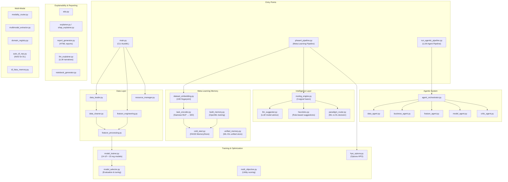

# ML-Builder — Complete System Architecture Walkthrough

> **Project**: A Meta-Learning AutoML system that combines FAISS-based memory retrieval, LLM reasoning, heuristic rules, and multi-modal support to automate the entire ML/DL pipeline — from data ingestion through model selection, hyperparameter optimization, explainability, and report generation.

---

## High-Level Architecture



---

## System Layers — File-by-File Breakdown

### Layer 1: Entry Points & Orchestration

#### [main.py](file:///c:/Dinesh/AutoML/ML-Builder/main.py) — CLI AutoML Pipeline
The **primary user-facing entry point** for traditional AutoML. Orchestrates a linear pipeline:

1. **Load** → `data_loader.load_dataset()` — reads CSV/Excel, detects problem type, drops ID/leaky columns, stratified train/test split
2. **Clean** → `data_cleaner.clean()` — removes duplicates, imputes missing values (median for numeric, mode for categorical)
3. **Resource Analysis** → `resource_manager.ResourceManager.analyze()` — classifies dataset as small/medium/large and constrains FE level, model selection, and CV folds accordingly
4. **Feature Engineering** (optional) → `feature_engineering.FeatureEngineer` — adaptive transforms (skew correction, outlier capping, interaction/ratio/polynomial features, high-cardinality encoding)
5. **Feature Processing** → `feature_processing.build_preprocessor()` — builds a `ColumnTransformer` with imputation + scaling (Standard vs Robust, per-column adaptive) + encoding (OneHot, FeatureHasher)
6. **Baseline Screening** → `model_trainer.baseline_screen()` — fast evaluation of all candidate models on a subsample, drops underperformers (bottom 30% of score range)
7. **Full Training** → `model_trainer.full_train()` — cross-validated training on full data for promising models, refitting best weights on all data
8. **Evaluation & Selection** → `model_selector.evaluate_models()` + `select_best()` — computes accuracy/precision/recall/F1/ROC-AUC (classification) or RMSE/MAE/R² (regression), picks best by F1 or RMSE
9. **Optional Tuning** → `model_selector.tune_top_models()` — GridSearchCV or RandomizedSearchCV on top-2 models
10. **EDA + Explainability + Report** → `eda.run_eda()`, `explainer.run_explanations()`, `report_generator.generate_report()` — produces a self-contained HTML report with embedded base64 images

> **CLI**: `python main.py --dataset data.csv --target label --enable_fe --report`

---

#### [phase4_pipeline.py](file:///c:/Dinesh/AutoML/ML-Builder/phase4_pipeline.py) — Meta-Learning Pipeline (Research Pipeline)
The **research-grade pipeline** that adds meta-learning, memory retrieval, paradigm routing, and multi-modal support on top of the core ML pipeline. This is the **most complex file** (636 lines).

**Flow for Tabular Data:**
1. Compute 10D dataset embedding → encode to 32D via Siamese encoder
2. Query FAISS memory for 5 nearest neighbor datasets
3. Get LLM model suggestions via `llm_suggester`
4. Run paradigm routing (`route_paradigm`) → decides **AutoML vs AutoDL**
5. If AutoML: run Optuna HPO on FAISS-retrieved top models with memory warm-start → SHAP explanations → LLM consultant report → save results back to FAISS memory
6. If AutoDL: run NAS (Neural Architecture Search) via Optuna on `DynamicMLP` → train final production model → save to modality-specific FAISS

**Flow for Multi-Modal Data (vision/audio/text/video):**
1. `OnboardingAgent` detects modality + gathers business context via LLM
2. `UniversalEmbedder` extracts embeddings from the folder
3. Forces paradigm to AutoDL → runs NAS pipeline

---

#### [run_agentic_pipeline.py](file:///c:/Dinesh/AutoML/ML-Builder/run_agentic_pipeline.py) — Agentic LLM Pipeline
Entry point for the **LLM-agent-driven AutoML** workflow. Delegates to `AgenticAutoMLOrchestrator`, and if the Critic Agent approves, triggers `phase4_pipeline.run_single_dataset_pipeline()` for execution.

---

### Layer 2: Data Ingestion & Processing

| File | Role | Key Details |
|------|------|-------------|
| [data_loader.py](file:///c:/Dinesh/AutoML/ML-Builder/data_loader.py) | Loads CSV/Excel, returns `DataBundle` | Auto-detects problem type (classification if <10 unique targets), drops ID columns (>50% unique), detects & drops leaky features (correlation >0.95 or single-feature AUC >0.98), label-encodes classification targets |
| [data_cleaner.py](file:///c:/Dinesh/AutoML/ML-Builder/data_cleaner.py) | Removes duplicates, imputes missing | Median for numeric, mode for categorical. Keeps y-series in sync with X when rows are removed |
| [feature_processing.py](file:///c:/Dinesh/AutoML/ML-Builder/feature_processing.py) | Builds `ColumnTransformer` | Standard/Robust scaling per-column, OneHotEncoder for low-cardinality, FeatureHasher (2048 features) for high-cardinality, mutual-info feature selection |
| [feature_engineering.py](file:///c:/Dinesh/AutoML/ML-Builder/feature_engineering.py) | Adaptive FE engine (571 lines) | 4 levels: `light` → `medium` → `full` → `auto`. Transforms: zero-variance removal, datetime extraction (cyclical month/weekday), high-cardinality encoding (CV target encoding with smoothing), skewness correction (log1p), outlier capping (IQR), adaptive scaling (D'Agostino normality test), interaction features, ratio features, polynomial features |
| [resource_manager.py](file:///c:/Dinesh/AutoML/ML-Builder/resource_manager.py) | Prevents OOM & feature explosion | Classifies datasets: small (<50K), medium (<200K), large (200K+). Caps FE level, restricts model set, applies hard cap on OneHot features (5000 max), forces frequency/hash encoding for high-cardinality columns |

---

### Layer 3: Model Training & Selection

| File | Role | Key Details |
|------|------|-------------|
| [model_trainer.py](file:///c:/Dinesh/AutoML/ML-Builder/model_trainer.py) | Model catalogue + training loops | **14 classification models**: Logistic, SGD, KNN, NaiveBayes, DecisionTree, SVC, MLP, RandomForest, ExtraTrees, AdaBoost, Bagging, HistGradientBoosting, LightGBM, XGBoost. **15 regression models**: Ridge, Lasso, ElasticNet, SGD, KNN, DT, SVR, MLP, RF, ET, Ada, Bag, HistGB, LGBM, XGB. Custom CV loop with per-fold LabelEncoder, single-split mode for large datasets, time budget enforcement |
| [model_selector.py](file:///c:/Dinesh/AutoML/ML-Builder/model_selector.py) | Evaluation, selection, tuning, persistence | Computes full metric suites, selects best by F1/RMSE, optional Grid/RandomizedSearchCV, saves models via joblib |
| [multi_objective.py](file:///c:/Dinesh/AutoML/ML-Builder/multi_objective.py) | Multi-objective utility scoring | `Utility = w1·Accuracy + w2·Speed + w3·Simplicity`. Model complexity map (1-4 scale). Task-aware defaults: classification (0.6/0.3/0.1), regression (0.8/0.15/0.05). Score-drop guard: only considers models within 5% of best score |
| [hpo_optuna.py](file:///c:/Dinesh/AutoML/ML-Builder/hpo_optuna.py) | Optuna hyperparameter optimization | Search spaces for XGBoost, RF, LightGBM, linear models. **Memory warm-start**: enqueues hyperparameters from similar past datasets as the first trial. 10 trials per model. WandB callback integration |

---

### Layer 4: Meta-Learning Memory System

This is the **research core** of the project — a FAISS-powered knowledge base that learns from past experiments.

#### [dataset_embedding.py](file:///c:/Dinesh/AutoML/ML-Builder/dataset_embedding.py) — 10D Statistical Fingerprint
Computes a fixed-length `float32` embedding vector capturing a dataset's statistical fingerprint:

| Dim | Feature | Computation |
|-----|---------|-------------|
| 0 | n_samples | `log1p(rows) / 10` |
| 1 | n_features | `log1p(cols) / 10` |
| 2 | samples-to-features ratio | `log1p(rows/cols) / 10` |
| 3 | mean skewness | `skew.mean() / 5`, clipped |
| 4 | high-skew fraction | `(|skew| > 1).mean()` |
| 5 | mean pairwise correlation | Upper-triangle mean of `|corr|` |
| 6 | coefficient of variation | `tanh(mean(std / |mean|))` |
| 7 | target cardinality | `log1p(nunique) / 5` |
| 8 | target entropy | Normalized Shannon entropy |
| 9 | missing rate | Global `NaN` fraction |

---

#### [task_encoder.py](file:///c:/Dinesh/AutoML/ML-Builder/task_encoder.py) — Siamese MLP Encoder (10D → 32D)
A **contrastive learning** neural network that maps raw 10D meta-features into a learned 32D embedding space:

- **Architecture**: `Linear(10→64) → BatchNorm → ReLU → Linear(64→32) → L2-normalize`
- **Training**: Siamese contrastive loss with margin=1.0. Positive pairs = datasets whose best model belongs to the same **family** (tree_based, linear, distance, neural_ml, kernel, bagging). 1:2 positive-to-negative ratio.
- **Early stopping**: patience=20, ReduceLROnPlateau scheduler
- **Purpose**: Datasets needing similar model families end up close in embedding space → better FAISS retrieval

---

#### [cold_start.py](file:///c:/Dinesh/AutoML/ML-Builder/cold_start.py) — Adaptive Cold-Start Router (847 lines)
The decision engine that chooses between **memory-based** (retrieve from similar past experiments) and **cold-start** (broad search) strategies:

**Core Algorithm:**
1. Query FAISS index for top-K (10) nearest neighbors
2. Compute cosine similarity for each neighbor
3. Compute **adaptive weighted score**: `Score = α·Similarity + β·Performance + γ·Recency` (α=0.6, β=0.3, γ=0.1)
4. Compute adaptive threshold: `ε(D) = μ_combined - λ·σ_combined`
5. Apply **similarity floor** (0.75) — if best similarity < 0.75, always cold-start
6. If best_combined ≥ ε: **memory path** — retrieve best models from neighbors, map model names across problem types
7. If below threshold: **cold-start path** — use default fallback model lists

**Key Classes:**
- `MemoryStore`: FAISS index + `DatasetRecord` list with pickle persistence. Supports add, remove, search, rebuild
- `ColdStartConfig`: Hyperparameters (k_neighbors, lambda_sensitivity, alpha/beta/gamma, recency_decay_days)
- `ColdStartLogger`: Paper-ready structured logging

---

#### [build_memory.py](file:///c:/Dinesh/AutoML/ML-Builder/build_memory.py) — Memory Builder
Populates the FAISS memory store from **300+ OpenML datasets**:

1. Fetches dataset from OpenML, subsamples to 2000 rows max
2. Cleans data, computes 10D embedding
3. Trains all models via baseline screening (3-fold CV, full sample)
4. Selects best model using multi-objective utility scoring
5. Stores `{dataset_id, embedding, best_model, hyperparameters}` in MemoryStore
6. After all datasets: trains the Siamese Task Encoder, rebuilds FAISS with 32D learned embeddings

---

#### [unified_memory.py](file:///c:/Dinesh/AutoML/ML-Builder/unified_memory.py) — Unified ML+DL Memory
Extends memory to accommodate **both ML and DL** models in a single FAISS index:
- `MemoryEntry` with `paradigm` field ("ML" or "DL")
- `paradigm_aware_selection()`: Ranks candidates by `similarity × performance - time_penalty`, deduplicates strategies
- `unified_cold_start()`: Wrapper that integrates paradigm-aware selection with the cold-start logic

---

### Layer 5: Intelligence & Routing

| File | Role | Key Details |
|------|------|-------------|
| [routing_engine.py](file:///c:/Dinesh/AutoML/ML-Builder/routing_engine.py) | 3-signal model fusion | Combines memory, LLM, and heuristic signals: `Score = λ_memory · MemScore + λ_llm · LLMScore + λ_heuristic · HeuScore`. Position-based scoring (top-ranked = highest). Default weights: 0.6/0.2/0.2. Logs to WandB |
| [llm_suggester.py](file:///c:/Dinesh/AutoML/ML-Builder/llm_suggester.py) | LLM model suggestions | Sends dataset meta-features to LLM (via litellm/OpenRouter), validates returned model names against exact catalogue, returns top-3 suggestions |
| [heuristics.py](file:///c:/Dinesh/AutoML/ML-Builder/heuristics.py) | Rule-based model suggestions | 9 classification rules + 7 regression rules based on dataset size, cardinality, dimensionality, skewness, multicollinearity, missing rate |
| [paradigm_router.py](file:///c:/Dinesh/AutoML/ML-Builder/paradigm_router.py) | ML vs DL decision | `R(D) = λ₁·LLM(D) + λ₂·Memory(D) + λ₃·Heuristics(D)`. If R(D) > τ (0.5) → AutoDL, else AutoML. LLM asks for probability that DL outperforms ML. Memory checks if past winners used DL |

---

### Layer 6: Agentic System

The `agents/` directory implements an **LLM-agent-based AutoML consultant**:

| Agent | Role | Key Details |
|-------|------|-------------|
| [agent_orchestrator.py](file:///c:/Dinesh/AutoML/ML-Builder/agents/agent_orchestrator.py) | Pipeline coordinator | Orchestrates all agents sequentially: Data → Business → Critic (Phase 1) → Feature → Model → Critic (Phase 2) → Report. Loads FAISS memory and queries it for model recommendations |
| [data_agent.py](file:///c:/Dinesh/AutoML/ML-Builder/agents/data_agent.py) | Dataset understanding | Sends dataset preview to LLM → detects target column, problem type, data quality notes. Generates EDA notebook |
| [business_agent.py](file:///c:/Dinesh/AutoML/ML-Builder/agents/business_agent.py) | Business context | Gathers user requirements via interactive prompts, translates to ML objectives (optimization priority, model constraints, risk tolerance) via LLM |
| [feature_agent.py](file:///c:/Dinesh/AutoML/ML-Builder/agents/feature_agent.py) | Feature engineering plan | LLM recommends missing value strategy, categorical encoding, transformations, feature selection |
| [model_agent.py](file:///c:/Dinesh/AutoML/ML-Builder/agents/model_agent.py) | Model selection | Combines dataset profile + ML objectives + FAISS memory context → LLM recommends top-3 models |
| [critic_agent.py](file:///c:/Dinesh/AutoML/ML-Builder/agents/critic_agent.py) | Quality gate | **Two validation passes**: (1) validates data profile + requirements for metric mismatches, target leakage, feasibility; (2) validates full pipeline for data leakage, model mismatch, resource mismatch. Robust JSON parser with `<think>` tag stripping |

All agents use **litellm** for LLM calls (configurable model via `LLM_MODEL` env var or `config.py`), default to OpenRouter models.

---

### Layer 7: Explainability & Reporting

| File | Role |
|------|------|
| [eda.py](file:///c:/Dinesh/AutoML/ML-Builder/eda.py) | Generates target distribution, feature distributions, correlation heatmap (PNG plots via matplotlib/seaborn) |
| [explainer.py](file:///c:/Dinesh/AutoML/ML-Builder/explainer.py) | Feature importance (built-in or permutation), SHAP summary + importance plots |
| [shap_explainer.py](file:///c:/Dinesh/AutoML/ML-Builder/shap_explainer.py) | Standalone SHAP explanation generator for phase4 pipeline |
| [report_generator.py](file:///c:/Dinesh/AutoML/ML-Builder/report_generator.py) | Self-contained HTML report with base64-embedded images, styled with modern CSS |
| [llm_explainer.py](file:///c:/Dinesh/AutoML/ML-Builder/llm_explainer.py) | LLM-generated narrative explanations and comprehensive consultant reports |
| [notebook_generator.py](file:///c:/Dinesh/AutoML/ML-Builder/notebook_generator.py) | Generates Jupyter notebooks with EDA/analysis code |

---

### Layer 8: Multi-Modal Support

| File | Role |
|------|------|
| [modality_router.py](file:///c:/Dinesh/AutoML/ML-Builder/modality_router.py) | Detects data modality by scanning file extensions (vision/text/audio/video/tabular) |
| [multimodal_extractor.py](file:///c:/Dinesh/AutoML/ML-Builder/multimodal_extractor.py) | `UniversalEmbedder` — extracts embeddings from image folders (CLIP/ResNet), audio (MFCC), text (SentenceTransformers), video (frame sampling + CLIP) |
| [domain_registry.py](file:///c:/Dinesh/AutoML/ML-Builder/domain_registry.py) | Domain-specific vision model configs (general/biology/remote_sensing/documents) |
| [auto_dl_nas.py](file:///c:/Dinesh/AutoML/ML-Builder/auto_dl_nas.py) | Neural Architecture Search via Optuna — searches `DynamicMLP` architecture (layers, hidden dim, dropout, LR, batch size) |
| [dl_faiss_memory.py](file:///c:/Dinesh/AutoML/ML-Builder/dl_faiss_memory.py) | Modality-specific FAISS memory for DL experiments (separate from tabular memory) |

---

### Layer 9: Infrastructure

| File | Role |
|------|------|
| [config.py](file:///c:/Dinesh/AutoML/ML-Builder/config.py) | Global config: WandB settings, LLM model selection |
| [wandb_logger.py](file:///c:/Dinesh/AutoML/ML-Builder/wandb_logger.py) | Thin WandB wrapper: `log()`, `log_image()`, `log_table()`, `log_artifact()`, `alert()` — all no-ops if `USE_WANDB=False` |
| [onboarding_agent.py](file:///c:/Dinesh/AutoML/ML-Builder/onboarding_agent.py) | Interactive user onboarding — detects modality, gathers business context via LLM, identifies target column |
| [dataset_profiler.py](file:///c:/Dinesh/AutoML/ML-Builder/dataset_profiler.py) | Extracts structural profile dict for paradigm routing |
| [confidence_calibration.py](file:///c:/Dinesh/AutoML/ML-Builder/confidence_calibration.py) | Confidence calibration for memory retrieval decisions |

---

## Data Flow Diagrams

### Flow 1: Standard CLI Pipeline (`main.py`)

```
CSV/Excel → load_dataset() → DataBundle
                                  ↓
                            clean(X_train, y)
                                  ↓
                        ResourceManager.analyze()
                            ↓              ↓
                    [do_fe=True]     [do_fe=False]
                         ↓                 ↓
              FeatureEngineer       X_train_final = X_clean
              .fit_transform()
                         ↓
                 build_preprocessor()
                         ↓
                 baseline_screen()  ← subsample (30%)
                    ↓ (filter)
                 full_train()       ← full data, CV
                         ↓
                 evaluate_models()
                         ↓
                 select_best()  → save_model()
                         ↓
              [EDA + SHAP + HTML Report]
```

### Flow 2: Meta-Learning Pipeline (`phase4_pipeline.py`)

```
Dataset → compute_dataset_embedding() → 10D vector
               ↓
    encode_dataset(encoder) → 32D vector
               ↓
    FAISS.search(32D, k=5) → Neighbor indices
               ↓
    ┌──────────────────────────────┐
    │  3-Signal Routing Engine     │
    │  ┌────────┐ ┌─────┐ ┌─────┐ │
    │  │ Memory │ │ LLM │ │Heur.│ │
    │  └───┬────┘ └──┬──┘ └──┬──┘ │
    │      └─────────┼───────┘    │
    │          Weighted Fusion     │
    └──────────────┬───────────────┘
                   ↓
    ┌──────────────┴───────────────┐
    │      Paradigm Router         │
    │  R(D) = λ₁·LLM + λ₂·Mem     │
    │        + λ₃·Heur             │
    └──────┬───────────┬───────────┘
           ↓           ↓
      [AutoML]      [AutoDL]
           ↓           ↓
    Optuna HPO      NAS (DynamicMLP)
    (warm-start)    via Optuna
           ↓           ↓
    SHAP + Report   Train final model
           ↓           ↓
    Save to FAISS   Save to DL-FAISS
```

---

## Key Design Decisions

| Decision | Rationale |
|----------|-----------|
| 10D → 32D Siamese encoding | Raw statistical features are too coarse for similarity; contrastive learning clusters datasets by model-family affinity |
| Adaptive threshold ε(D) | Prevents false-positive memory retrievals when the dataset is truly novel |
| Similarity floor (0.75) | Absolute guard against using memory for truly dissimilar datasets |
| Multi-objective utility scoring | Avoids always picking the most complex model — balances accuracy/speed/simplicity |
| Memory warm-start for HPO | First Optuna trial uses hyperparameters from the most similar past experiment, significantly accelerating convergence |
| Resource Manager hard caps | Prevents OOM on large datasets by capping OneHot features, restricting FE level, limiting model set |
| Dual validation in Critic Agent | Two-pass LLM review catches both requirements-level and implementation-level issues |
| Cross-validated target encoding | Prevents target leakage in high-cardinality feature encoding with smoothing regularization |

---

## Persistent Artifacts

| File | Purpose |
|------|---------|
| `memory_store.faiss` | FAISS index (32D learned embeddings) |
| `memory_store.pkl` | Pickled `DatasetRecord` list (metadata + raw embeddings) |
| `task_encoder.pt` | Trained Siamese encoder weights |
| `dl_memory_*.faiss` / `dl_metadata_*.json` | Modality-specific DL FAISS indices |
| `reports/` | Generated HTML reports, EDA plots, SHAP plots, notebooks |
| `models/best_model.pkl` | Saved best model (joblib) |
| `models/metrics.csv` | Evaluation metrics table |
